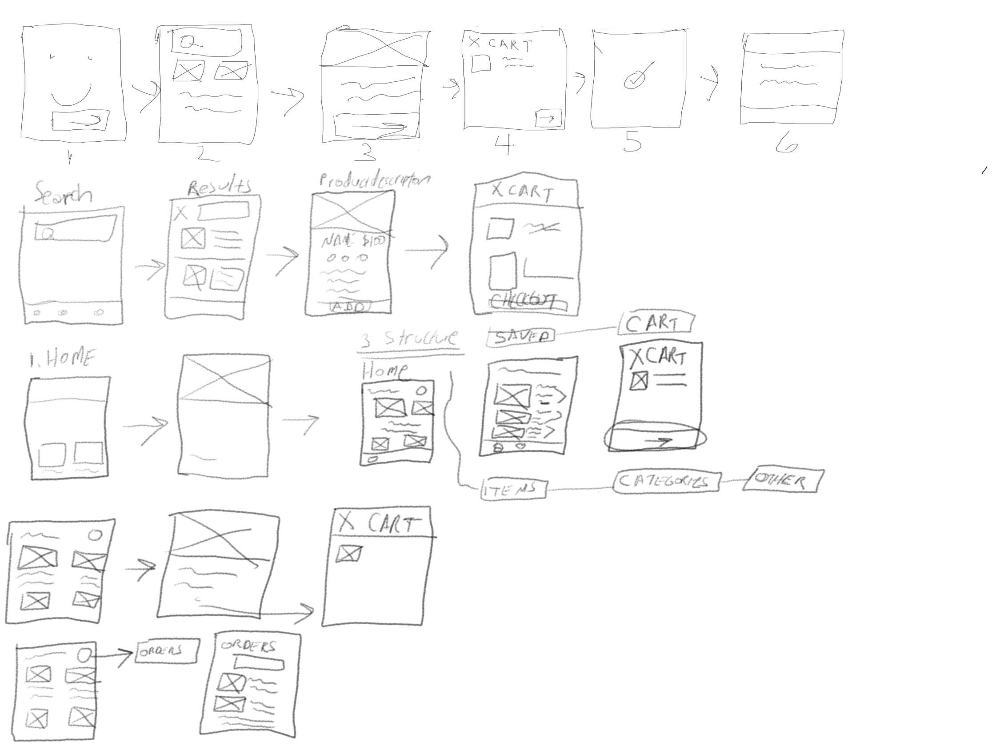
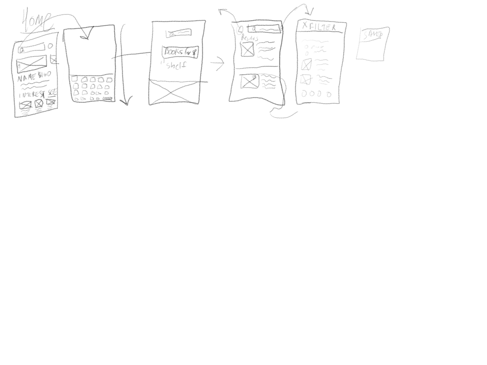

# Section 02 - Sketching

## Intro to Sketching
Sketching is a two step process. First we must generate ideas to sketch out - but then we must add more details, refine those details and iterate.
Generate as many options as possible early on just get the ideas flowing. As it becomes more refined a wireframe can be generated and again go over them until finally they are polished compoenents.

## The Sketching Process
1. Always be prepared.
 What are your Goals? 
 Who is your Audience?
 Time Yourself. Keep yourself under a time limit.
2. Ready Set Go.
Draw a frame for your device.
Start with simple and redundant elements
Then move onto more detailed interactions
Annotate your sketches and keep them safe.
Keep Going. Find sketches you like and then make them better
3. Refinement
Add titles to your sketches
Add annotations...again - the more notes the better
Use Numbers to label different layouts
And arrows!
Add Gestures if you want.

## Sketching Tips
1. Dont be afraid to be messy. Just keep going. Create quickly. Be lean. Be agile. Sketch quickly and save yourself some time instead of worrying about the details.
2. It takes practice to sketch well. Just use simple shapes to convey messages.
3. Take care of your sketches. Keep a folder for them or store them digitally if possible.
4. Keep your tablet or notebook by your side at all times. You never know when a new idea will come to you.
5. Hang up your sketches so you can look at them while you are standing.
6. Communicate.
7. Get a white board and use it.
8. Grab a sketch and try to exaggerate how users feel throughout the process

